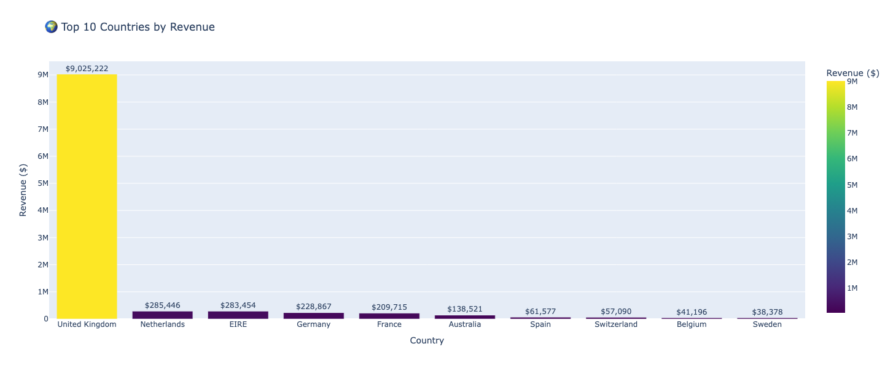
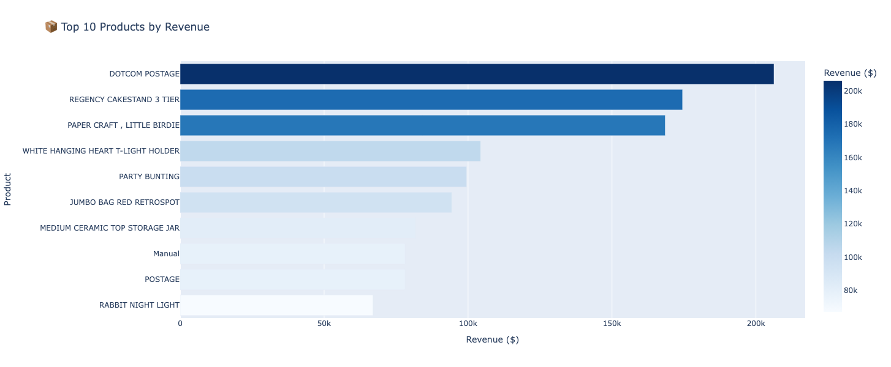
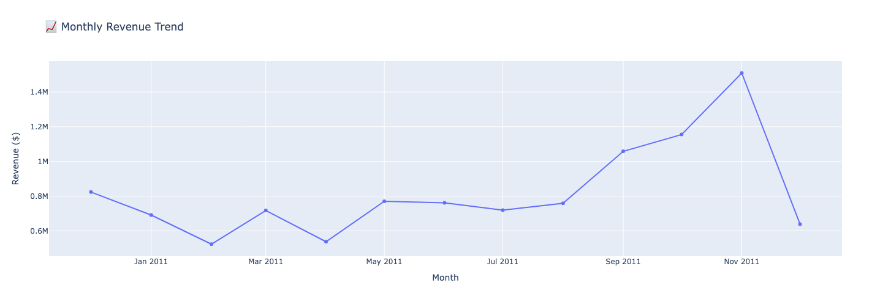

# E-Commerce Data Pipeline

An end-to-end data engineering project implementing a Bronze-Silver-Gold architecture to process and analyze 540K+ e-commerce transactions.

---

## Project Overview

Built a scalable data pipeline that processes e-commerce transaction data through multiple transformation layers, implementing data quality checks and generating business insights through interactive visualizations.

**Key Achievement:** Cleaned 541,909 transactions, removing 0.46% of bad data while retaining 99%+ of revenue data for analysis.

---

## Architecture
```
Raw Data (CSV)
    ↓
Bronze Layer (S3) - Raw data storage
    ↓
Apache Spark - Data cleaning & transformation
    ↓
Silver Layer (S3) - Cleaned, validated data
    ↓
Gold Layer (S3) - Business aggregations
    ↓
AWS Athena - SQL analytics
    ↓
Visualizations - Interactive dashboards
```

---

## Tech Stack

- **Data Processing:** Apache Spark (PySpark), Python, Pandas
- **Cloud Storage:** AWS S3 (Bronze/Silver/Gold layers)
- **Data Format:** Parquet (columnar, compressed)
- **Query Engine:** AWS Athena
- **Visualization:** Plotly (interactive charts)
- **Development:** Google Colab, Jupyter Notebooks
- **Version Control:** Git, GitHub

---

## Key Business Insights

### Revenue Analysis
- **Total Revenue:** $9.75M across 12 months
- **Top Market:** United Kingdom (92% of total revenue - $9.03M)
- **Growth Rate:** 83% increase from Dec 2010 ($824K) to Nov 2011 ($1.51M)

### Product Performance
- **Best Seller:** DOTCOM POSTAGE ($206K revenue)
- **Top 10 Products:** Contribute $1.2M in revenue
- **Popular Categories:** Home decor, gift items, party supplies

### Customer Segments
- **Registered Customers:** 406,789 transactions (75.4%)
- **Guest Purchases:** 132,603 transactions (24.6%, $1.73M revenue)
- **Returns:** 9,288 transactions properly tracked

---

## Visualizations

### Sales by Country
Top performing countries by revenue:



### Top Products
Best-selling products analysis:



### Monthly Revenue Trend
Revenue growth over time showing seasonal patterns:



---

## Data Pipeline Process

### Bronze Layer (Raw Data)
- Source: Kaggle E-commerce dataset
- Format: CSV (541,909 rows, 8 columns)
- Storage: s3://bucket/raw/data.csv

### Silver Layer (Data Cleaning)

**Data Quality Issues Identified:**
- 135,080 NULL CustomerIDs (24.9%)
- 10,624 negative quantities
- 2,517 bad prices (≤ $0)
- 1,454 NULL descriptions

**Transformations Applied:**
- Removed 2,517 bad records (0.46%)
- Created customer_type: "Guest" vs "Registered"
- Added is_return flag for returns tracking
- Filled NULL descriptions with "Unknown Product"
- Created TotalPrice: Quantity × UnitPrice
- Parsed dates: Extracted Year, Month, Day, Hour

**Result:** 539,392 clean records in Parquet format

### Gold Layer (Business Aggregations)

Created analytical tables:
- **Sales by Country:** Revenue, order count, unique customers per country
- **Top Products:** Best sellers by revenue and quantity
- **Monthly Revenue:** Time-series analysis of sales trends

---

## Data Engineering Decisions

### Why Keep Guest Purchases?
Initially considered dropping NULL CustomerIDs, but analysis revealed:
- 132K transactions = 24.6% of data
- $1.73M revenue = 17.8% of total revenue
- **Decision:** Segment as "Guest" customers rather than delete

### Why Remove Internal Adjustments?
Identified 1,336 records with:
- Negative quantities without "C" prefix (not customer returns)
- Descriptions like "damages", "faulty", "check"
- No customer information
- **Decision:** These are operational adjustments, not sales transactions

### Why Use Parquet Format?
- 70-80% compression vs CSV
- Columnar storage for fast queries
- Native support in Spark, Athena, and modern data tools

---

## How to Run

### Prerequisites
- Python 3.8+
- Apache Spark 3.5+
- AWS CLI configured
- AWS S3 bucket access

### Setup
```bash
# Clone repository
git clone https://github.com/Moulica5374/ecommerce-data-pipeline.git
cd ecommerce-data-pipeline

# Install dependencies
pip install pyspark pandas plotly boto3 awswrangler

# Configure AWS credentials
aws configure
```

### Run Pipeline
```bash
# Open Jupyter notebook
jupyter notebook notebooks/Ecommerce_Silver_Layer_Transformation.ipynb

# Or run in Google Colab
# Upload notebook and data.csv
```

---

## Project Structure
```
ecommerce-data-pipeline/
├── README.md
├── notebooks/
│   ├── 01_EDA_Investigation.ipynb
│   └── 02_Silver_Layer_Transformation.ipynb
├── images/
│   ├── sales_by_country.png
│   ├── top_products.png
│   └── monthly_revenue.png
└── data/
    └── sample_data.csv
```

---

## Skills Demonstrated

- Data Quality Analysis & Cleaning
- ETL Pipeline Design (Bronze-Silver-Gold)
- Apache Spark (PySpark) Transformations
- AWS S3 Data Lake Architecture
- SQL Query Optimization (Athena)
- Data Visualization & Storytelling
- Business Logic Implementation
- Cloud Data Engineering (AWS)

---

## Future Enhancements

- Apache Airflow orchestration for automated daily runs
- AWS Glue jobs for cloud-based Spark processing
- Real-time streaming with AWS Kinesis
- Advanced analytics: Customer segmentation, RFM analysis
- ML models: Demand forecasting, churn prediction
- CI/CD pipeline with GitHub Actions
- Data quality monitoring with Great Expectations

---

## License

This project is open source and available under the MIT License.

---

## Author

**Moulica Goli**
- GitHub: [@Moulica5374](https://github.com/Moulica5374)

---

## Acknowledgments

- Dataset: Online Retail Dataset from Kaggle
- Tools: Apache Spark, AWS, Plotly
